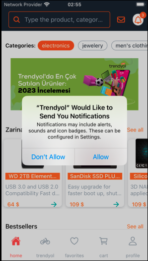
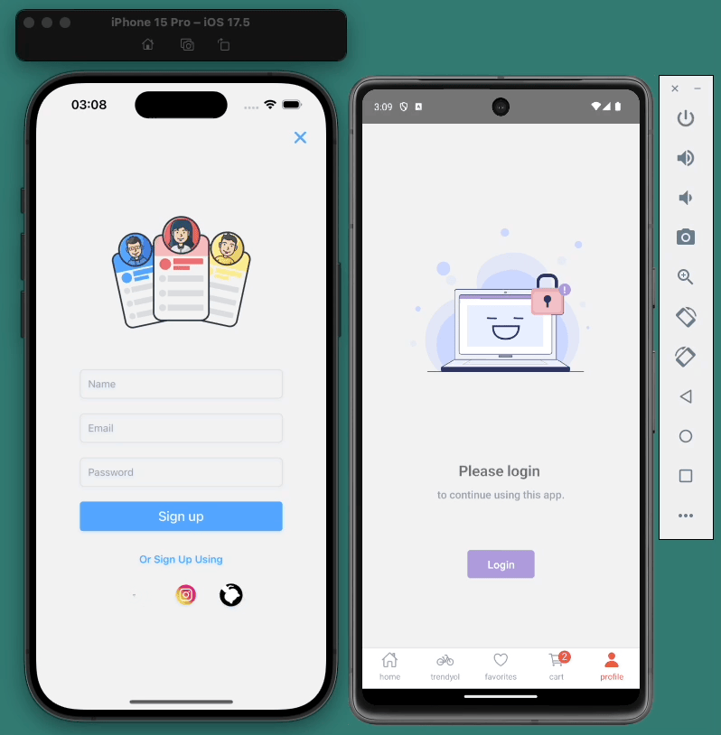
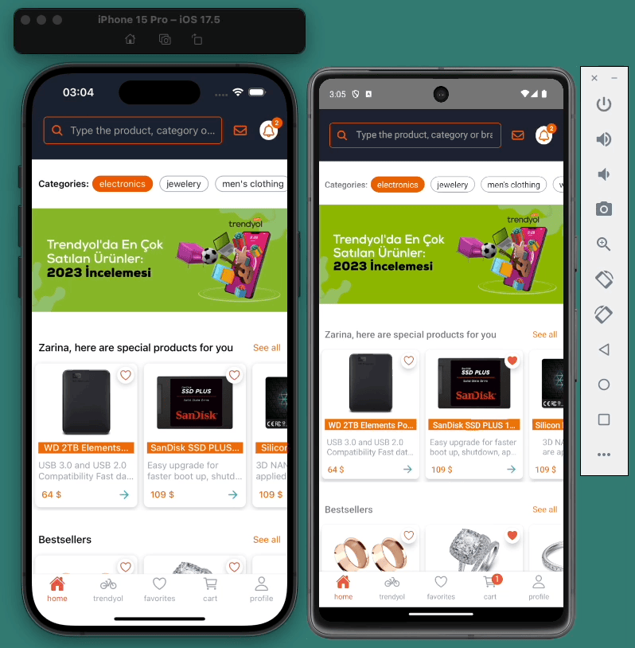
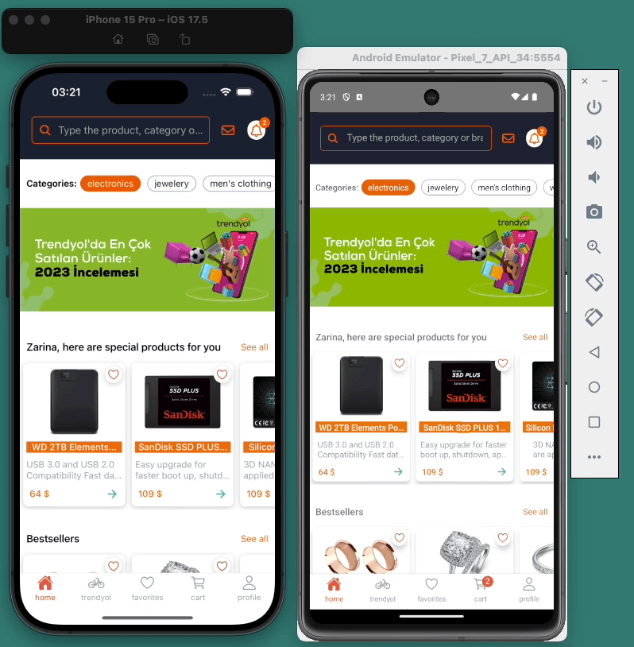

# Trendyol Clone App

**Trendyol App** is a modern mobile shopping application built with React Native. Designed to provide a seamless e-commerce experience, this app integrates a variety of powerful libraries and tools to deliver high performance and a user-friendly interface.

## Features

- **Product Browsing**: Discover and explore a wide range of products with smooth navigation.
- **User Authentication**: Secure login and registration using Firebase Authentication.
- **Real-time Updates**: Receive notifications and real-time updates through Firebase Cloud Messaging.
- **Async Storage**: Persist user data and preferences with Async Storage.
- **Enhanced UI**: Enjoy a polished user experience with animations and vector icons.

## Technologies

- **React Native**: Core framework for building native mobile apps.
- **Firebase**: Backend services for authentication, real-time database, and messaging.
- **React Navigation**: Powerful navigation solution for seamless transitions between screens.
- **Redux Toolkit**: Manage global state efficiently.
- **Formik & Yup**: Simplified form handling and validation.
- **Axios**: HTTP client for network requests.
- **Lottie**: Beautiful animations for a modern UI.
- **Fast Image**: Optimized image loading for improved performance.

## Screenshots

